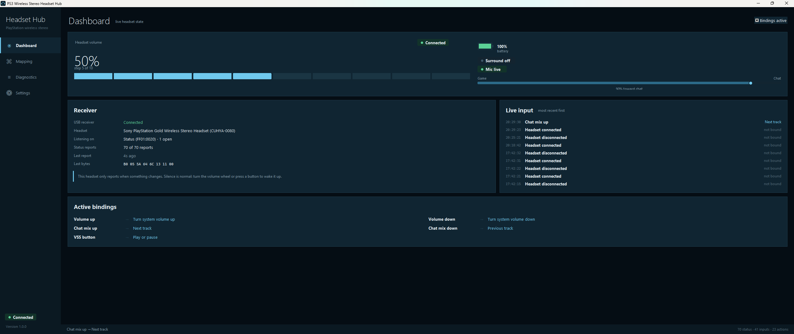

# PS3 Wireless Stereo Headset Hub for Windows

> **A community-driven Windows interface for the Sony PlayStation Wireless Stereo Headset.**




## Why does this project exist?

I have a collection of these Sony wireless headsets.

They were designed around the PlayStation ecosystem, where the headset feels like an actual part of the console experience. On PS3 and PS4, you could see headset information, manage settings, and interact with the device instead of treating it as just another anonymous USB audio peripheral.

When using the same headsets on a PC, that experience is largely missing.

I always wanted to have **that kind of interface on Windows** — something that makes the headset feel like a supported device again.

So this project started with a simple idea:

> **Why not build the interface I always wished existed for PC?**

And once the headset is understood, there is no reason to stop at simply displaying battery information.

The long-term goal is to build a proper Windows companion application that can expose the headset's capabilities and potentially add useful PC-oriented features such as **media/music controls, headset controls, status information, diagnostics, and more**.

This repository therefore contains both the current application work and the reverse-engineering PoC used to understand the Sony USB receiver.

---

## What is this?

The **PS3 Wireless Stereo Headset Hub for Windows** is a Windows-focused project for communicating with and building an interface around Sony's PlayStation Wireless Stereo Headset USB receiver.

The project currently concentrates on the receiver's HID interface:

```
┌───────────────────────────┐
│ Sony Wireless Headset     │
└─────────────┬─────────────┘
              │ wireless
              ▼
┌───────────────────────────┐
│ Sony USB Wireless         │
│ Receiver                  │
│ VID 12BA / PID 0035       │
└─────────────┬─────────────┘
              │ USB HID
              ▼
┌───────────────────────────┐
│ Windows HID subsystem     │
└─────────────┬─────────────┘
              │
       ┌──────┴──────┐
       ▼             ▼
    HIDAPI       Windows Raw Input
       │             │
       └──────┬──────┘
              ▼
┌───────────────────────────┐
│ Protocol decoder          │
└─────────────┬─────────────┘
              ▼
┌───────────────────────────┐
│ Windows application       │
└───────────────────────────┘
```

The original PoC is deliberately **receive-only** while the protocol is being investigated. It does not send HID output reports, feature reports, control commands, or battery-polling commands.

---

# Project goals

The project has two closely related goals.

### 1. Understand the hardware

Reverse-engineer the USB receiver and determine how it reports:

- headset connection
- battery level
- charging state
- volume
- game/chat balance
- VSS
- microphone mute
- headset family/mode information
- other currently unknown data

### 2. Build a real Windows experience

Turn that knowledge into a polished application that makes the headset feel like a first-class PC device.

The eventual direction is not limited to displaying telemetry.

Potential PC features include:

- headset status dashboard
- battery and charging display
- volume controls
- microphone controls
- VSS controls
- game/chat balance
- media/music controls
- play/pause
- previous/next track
- Windows media integration
- desktop notifications
- tray application
- diagnostics
- HID packet inspection
- capture/replay tools
- configurable shortcuts
- additional headset-specific features discovered during reverse engineering

Some of these are future goals and are **not currently implemented**.

---

# Current status

The project is actively being developed.

## Currently implemented / investigated

| Feature | Status |
|---|---|
| Sony receiver detection | ✅ |
| VID/PID identification | ✅ |
| HID collection enumeration | ✅ |
| HID report monitoring | ✅ |
| Windows native HID reader | ✅ |
| Windows Raw Input diagnostic path | ✅ |
| Raw report logging | ✅ |
| JSONL capture files | ✅ |
| Session summaries | ✅ |
| HID descriptor investigation | ✅ |
| `B0` status packet detection | ✅ |
| Battery telemetry | ✅ |
| Charging detection | ✅ |
| Volume telemetry | ✅ |
| Chat/game balance telemetry | ✅ |
| VSS state | ✅ |
| Microphone mute state | ✅ |
| Headset link state | ✅ |
| Protocol unit tests | ✅ |
| Full PC headset controls | 🚧 |
| HID output/control protocol | 🚧 |
| Pairing research | 🚧 |
| Music/media controls | 🚧 |
| Complete audio integration | 🚧 |

The exact implementation status can change as the project develops.

---

# The known B0 status packet

One of the most important discoveries so far is an 8-byte HID status report beginning with `0xB0`.

```
Byte       00    01    02    03    04    05    06    07
          ┌────┬────┬────┬────┬────┬────┬────┬────┐
Report    │ B0 │ VV │ CC │ BB │ FF │ XX │ 11 │ 00 │
          └────┴────┴────┴────┴────┴────┴────┴────┘
            │    │    │    │    │    │    │    │
            │    │    │    │    │    │    │    │
            │    │    │    │    │    │    │    └─ observed constant
            │    │    │    │    │    │    └────── observed constant
            │    │    │    │    │    └─────────── currently unknown
            │    │    │    │    └──────────────── flags
            │    │    │    └───────────────────── battery
            │    │    └────────────────────────── chat balance
            │    └─────────────────────────────── volume
            └──────────────────────────────────── report ID
```

Current decoder knowledge includes:

- volume raw level
- chat/game balance
- battery percentage
- charging state
- VSS
- microphone mute
- headset link state
- headset family/mode flags

See [TECHNICAL_README.md](TECHNICAL_README.md) for the detailed protocol documentation and confidence levels.

---

# Application

The project is intended to become more than a diagnostic console.

The application is being designed around the idea of a **PlayStation-style headset control experience for Windows**.

### Concept

```
┌──────────────────────────────────────────────┐
│ PS3 Wireless Stereo Headset                  │
├──────────────────────────────────────────────┤
│                                              │
│  🔋 Battery       🎧 Connected               │
│  ████████░░       YES                        │
│                                              │
│  🔊 Volume        🎙 Microphone              │
│  ███████░░░       ON                         │
│                                              │
│  🎮 Game/Chat     VSS                        │
│  ██████░░░░       ON                         │
│                                              │
│  ▶ Previous   ⏯ Play/Pause   ⏭ Next         │
│                                              │
└──────────────────────────────────────────────┘
```

The exact UI and available controls are still evolving.

**Screenshots will be added as the application UI stabilizes.**

---

# Why reverse-engineer it?

The receiver is not simply a generic USB audio device.

It exposes HID collections and status information that can provide information about the headset independently from the audio stream.

That makes it possible to investigate the device at a lower level:

```
USB device
   ↓
HID collections
   ↓
HID reports
   ↓
Raw bytes
   ↓
Protocol fields
   ↓
Meaning
   ↓
Application features
```

Rather than guessing what the headset does, the project captures real reports and compares them while changing one headset state at a time.

---

# PoC tools

The `poc/` directory contains the research and diagnostic tools.

### Live dashboard

```powershell
python poc/ps3_headset_panel.py
```

Provides a live Windows dashboard backed by detailed diagnostic logging.

### HID monitor

```powershell
python poc/ps3_headset_hid_monitor.py
```

Enumerates the Sony receiver, monitors HID input, and records captures.

### Windows Raw Input probe

```powershell
python poc/ps3_headset_rawinput_probe.py
```

Uses Windows Raw Input as a second diagnostic path.

This is useful when the receiver can be enumerated successfully but a direct HID reader does not receive reports.

---

# Installation

Windows is currently the primary target.

Install the Python dependencies:

```powershell
python -m pip install -r requirements.txt
```

Then run one of the PoC tools above.

For development and protocol testing:

```powershell
python -m pytest -q
```

---

# Captures

The PoC tools save diagnostic sessions under:

```
poc/logs/
```

A session may contain:

```
poc/logs/<timestamp>/
├── session.json
├── capture.jsonl
├── summary.json
└── HID descriptor information
```

These captures are important to the project because they allow protocol research without requiring every experiment to be performed again.

---

# Safety and development philosophy

The initial protocol research is intentionally conservative.

The PoC operates in:

```
HEADSET
   │
   ▼
RECEIVER
   │
   ▼
WINDOWS
   │
   ▼
READ
   │
   ▼
DECODE
   │
   ▼
LOG
```

It does **not** currently attempt arbitrary HID writes.

This lets the project establish what the receiver actually reports before experimenting with commands that could alter device state.

---

# Hardware

Known receiver:

```
Vendor ID:     0x12BA
Product ID:    0x0035
Manufacturer:  Sony Interactive Entertainment
```

The receiver exposes multiple HID collections, including vendor-defined collections.

The exact collections and usage pages should not be assumed to be identical across every revision of Sony's headset hardware. New captures should therefore be treated as evidence rather than automatically applying an interpretation from another device.

---

# Project structure

```
.
├── app/
│   └── Windows application
│
├── poc/
│   ├── ps3_headset_panel.py
│   ├── ps3_headset_hid_monitor.py
│   ├── ps3_headset_rawinput_probe.py
│   ├── ps3_headset_protocol.py
│   ├── ps3_headset_reader.py
│   └── logs/
│
├── tests/
│   └── protocol tests
│
├── requirements.txt
├── README.md
└── TECHNICAL_README.md
```

---

# Roadmap

The roadmap is intentionally open-ended.

### Foundation

- [x] Detect receiver
- [x] Enumerate HID collections
- [x] Capture input reports
- [x] Decode known telemetry
- [x] Build diagnostic tooling

### Application

- [x] Initial Windows GUI
- [X] Refine application UI
- [ ] Add persistent device state
- [ ] Tray integration
- [ ] Notifications
- [ ] Settings

### Headset controls

- [X] Fully understand output protocol
- [ ] Investigate safe volume control
- [X] Investigate VSS control
- [X] Investigate microphone control
- [X] Investigate game/chat balance control

### PC features

- [X] Music/media controls
- [ ] Windows media integration
- [ ] Configurable shortcuts
- [ ] Desktop integration
- [ ] Additional PC-specific functionality

### Reverse engineering

- [X] Identify remaining B0 fields
- [ ] Capture additional headset revisions
- [ ] Map every HID collection
- [ ] Investigate pairing
- [ ] Document command protocol
- [ ] Build a comprehensive replay/capture test suite

---

# Credits and references

The reverse-engineering work is informed in part by the Linux project:

**[counter185/hid-playstation-headset](https://github.com/counter185/hid-playstation-headset)**

That project documents the Sony `12BA:0035` receiver and provided an important reference point for understanding the known status report.

This Windows project is an independent implementation and research effort.

---

# Contributing

If you own one of these headsets and can capture useful HID behavior, additional hardware observations are extremely valuable.

Useful contributions include:

- HID descriptors
- raw report captures
- receiver revisions
- headset revisions
- behavior changes
- protocol observations
- application improvements
- Windows compatibility testing

When reporting a discovery, include:

1. Hardware model/revision if known
2. Receiver VID/PID
3. HID collection / usage information
4. Raw report bytes
5. What changed on the headset
6. What changed in the report

That makes observations reproducible.

---

# The long-term idea

This started because I have these headsets sitting in my collection and wanted to give them the experience they deserve on a PC.

I remember the headset being part of the PlayStation experience. On PC, I wanted something closer to:

> **Plug it in → Windows recognizes it → open the hub → see the headset → control it → use it.**

And if we are already reverse-engineering the hardware to make that possible, **why stop at reproducing the old console experience?**

The goal is to take what Sony exposed, understand it properly, and build something useful around it — including PC-oriented features that make sense today.

**This project is my attempt to finally give these headsets a proper home on Windows.**
