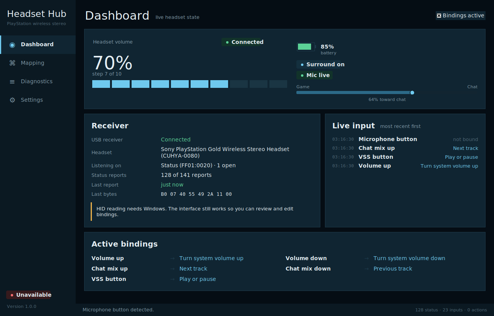

# PS3 Wireless Stereo Headset Hub for Windows

A desktop application for the **Sony PlayStation Gold Wireless Stereo Headset
(CUHYA-0080)** and its **CUHYA-0081** USB receiver (`12BA:0035`).

It shows live headset state, detects every control on the headset, and lets you
bind those controls to media keys, system volume, keyboard shortcuts, or any
program you like.



---

## Install and run

Needs Python 3.10 or newer and one package.

```powershell
python -m pip install -r requirements.txt
python main.py
```

Or just double-click **`run.bat`**, which installs the dependency if it is
missing.

To build a single `.exe` with no Python installation required:

```powershell
packaging\build.bat
```

That produces `dist\PS3HeadsetHub.exe`.

---

## How the mapping works, and what it cannot do

Read this before filing a bug. It explains a design constraint that comes from
the hardware, not from the software.

**The headset does not send button events.** The receiver emits an 8-byte
`0xB0` report describing its *current state* whenever something changes. There
is no "volume up was pressed" message anywhere in the protocol.

So a press is reconstructed from the difference between two consecutive state
reports:

```
volume 4 -> volume 5        becomes    Volume up
vss off  -> vss on          becomes    VSS button
balance 48 -> balance 56    becomes    Chat mix up
```

Two consequences follow, and the interface says both out loud:

1. **Your action runs in addition to the headset's own behaviour, never instead
   of it.** Binding Volume up to "next track" does not stop the headset
   changing its own volume. It acts in hardware and only reports afterwards.
   Nothing on the PC can intercept that.

2. **A control that cannot change the state produces no event.** At volume step
   10 the wheel still turns, but the reported value cannot rise, so no input is
   detected. The same applies at step 0 and at either end of the chat mix.

### Guarding against false presses

Reconstructing presses from state is where every false positive lives. Three
guards are applied, all tunable under Settings:

| Guard | What it stops |
|---|---|
| Baseline seeding | Switching the headset on firing one event per field |
| Settle window | The state echo the receiver sends right after linking |
| Resync rejection | A jump of eight steps firing eight actions after dropped reports |

A link transition always re-baselines, because values reported while the
headset was off are not comparable with values reported now.

---

## Using it

**Dashboard** shows volume, battery, chat mix, surround and microphone state,
plus a live feed of detected inputs and what each one triggered.

**Mapping** is the main workflow. Press **Listen**, touch the control on the
headset, and it is selected for you. Pick an action, and it saves
automatically. Bindings can be exported and imported as JSON.

Default bindings, which you can change or remove entirely:

| Headset control | Action |
|---|---|
| Chat mix up | Next track |
| Chat mix down | Previous track |
| VSS button | Play / pause |
| Volume up | Windows volume up |
| Volume down | Windows volume down |

Available actions: media keys, Windows volume and mute, any keyboard shortcut
(with a Record button), launching a program, and in-app notifications. New
actions are one `ActionDefinition` plus one handler in `ps3hub/actions.py`; the
mapping editor builds its form from the action's parameter schema, so no UI
work is needed to add one.

**Diagnostics** replaces the console the proof of concept relied on: report
counters, every HID collection with its open state and report count, any report
shape the decoder does not recognise (with raw bytes), and the live log with a
one-click copy for bug reports.

**Settings** holds the detection tuning above, plus an "open every HID
collection" switch for the case below.

### If no inputs are detected

The receiver sometimes enumerates without usable usage information and shows up
as "Unknown". The app already handles this: when the preferred `FF01:0020`
status collection is absent it opens *every* collection instead of giving up.
If inputs still do not appear, turn on **Open every HID collection** in
Settings, then check Diagnostics to see which collections are receiving
anything.

Remember that this headset is silent until something changes. Turn the volume
wheel to wake it.

---

## Volume and the 10 steps

The headset has **10 discrete volume steps**, reported as `0x00`–`0x0A`. The
app shows a percentage for readability, but the meter is drawn as ten separate
segments so the real resolution stays visible. Nothing here pretends to
continuous volume control, and a raw value outside `0x00`–`0x0A` is reported as
unknown rather than guessed at.

---

## Architecture

Layered so that nothing below the UI knows the UI exists.

```
protocol.py     pure byte decoding, zero I/O, fully unit tested
hid_reader.py   native Windows overlapped HID reads
inputs.py       state deltas -> discrete input events
actions.py      actions and Windows SendInput injection
mappings.py     input -> action binding model
config.py       atomic persistence
device.py       enumeration, hotplug, dispatch
ui/             presentation only
```

**Threading.** Reader threads only enqueue raw bytes. A single dispatch thread
owns the edge detector, so it always sees a strictly ordered stream, and runs
mapped actions directly for the lowest possible media-key latency. The Tk
thread only ever polls. No background thread touches a widget.

### What was kept from the proof of concept

The overlapped `ReadFile` transport in `hid_reader.py` is carried over
essentially unchanged. It is the hard-won part: a synchronous read blocks
forever inside the HID class driver and cannot be interrupted when the receiver
is unplugged. `decode_b0()` keeps its original signature and behaviour, and the
original protocol tests still pass unmodified. Enumeration remains on hidapi.

### What changed

- Reports are normalised before decoding, so a leading report-ID byte or
  trailing padding no longer causes a valid status packet to be dropped.
- Diagnostics go to a rotating log file and an in-app view instead of stdout,
  which a windowed build does not have.
- Unplug is classified as an expected event rather than an error, so replugging
  reconnects silently.
- Configuration is written atomically; an unreadable file is moved aside rather
  than discarded, and the app still starts.
- Bindings referencing an unknown action degrade to unbound instead of
  preventing startup.

---

## Development

```powershell
python -m pytest                          # unit tests
python tests\smoke_ui.py                  # builds and drives the whole UI
```

The smoke test walks every view, both editing paths and synthetic device
traffic. It catches Tk mistakes that compiling cannot.

`protocol.py` has no I/O at all, so recorded captures can be replayed against
the decoder without hardware.

---

## Credits

Protocol groundwork from
[`counter185/hid-playstation-headset`](https://github.com/counter185/hid-playstation-headset),
the reverse-engineered Linux driver documenting receiver `12BA:0035` and the
`0xB0` status report.
