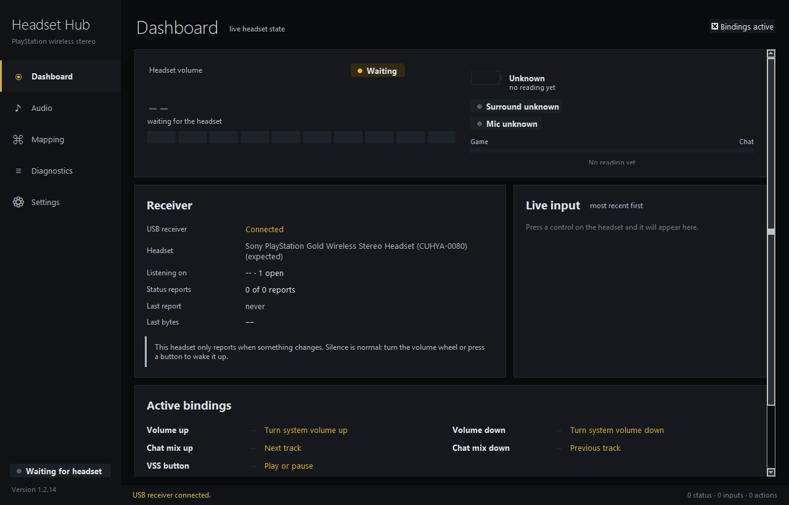

# PS3 Wireless Stereo Headset Hub for Windows

A desktop application for the **Sony PlayStation Gold Wireless Stereo Headset
(CUHYA-0080)** and its **CUHYA-0081** USB receiver (`12BA:0035`).

It shows live headset state, detects every control on the headset, and lets you
bind those controls to media keys, system volume, keyboard shortcuts, or any
program you like.



---

## Install and run

Needs Python 3.10 or newer and one package.

```powershell
python -m pip install -r requirements.txt
python main.py
```

Or just double-click **`run.bat`**, which installs the dependency if it is
missing.

To build a single `.exe` with no Python installation required:

```powershell
packaging\build.bat
```

That produces `dist\PS3HeadsetHub.exe`.

---

## How the mapping works, and what it cannot do

Read this before filing a bug. It explains a design constraint that comes from
the hardware, not from the software.

**The headset does not send button events.** The receiver emits an 8-byte
`0xB0` report describing its *current state* whenever something changes. There
is no "volume up was pressed" message anywhere in the protocol.

So a press is reconstructed from the difference between two consecutive state
reports:

```
volume 4 -> volume 5        becomes    Volume up
vss off  -> vss on          becomes    VSS button
balance 48 -> balance 56    becomes    Chat mix up
```

Two consequences follow, and the interface says both out loud:

1. **Your action runs in addition to the headset's own behaviour, never instead
   of it.** Binding Volume up to "next track" does not stop the headset
   changing its own volume. It acts in hardware and only reports afterwards.
   Nothing on the PC can intercept that.

2. **A control that cannot change the state produces no event.** At volume step
   10 the wheel still turns, but the reported value cannot rise, so no input is
   detected. The same applies at step 0 and at either end of the chat mix.

### Guarding against false presses

Reconstructing presses from state is where every false positive lives. Three
guards are applied, all tunable under Settings:

| Guard | What it stops |
|---|---|
| Baseline seeding | Switching the headset on firing one event per field |
| Settle window | The state echo the receiver sends right after linking |
| Resync rejection | A jump of eight steps firing eight actions after dropped reports |

A link transition always re-baselines, because values reported while the
headset was off are not comparable with values reported now.

---

## Using it

**Dashboard** shows volume, battery, chat mix, surround and microphone state,
plus a live feed of detected inputs and what each one triggered.

**Mapping** is the main workflow. Press **Listen**, touch the control on the
headset, and it is selected for you. Pick an action, and it saves
automatically. Bindings can be exported and imported as JSON.

Default bindings, which you can change or remove entirely:

| Headset control | Action |
|---|---|
| Chat mix up | Next track |
| Chat mix down | Previous track |
| VSS button | Play / pause |
| Volume up | Windows volume up |
| Volume down | Windows volume down |

Available actions: media keys, Windows volume and mute, any keyboard shortcut
(with a Record button), launching a program, and in-app notifications. New
actions are one `ActionDefinition` plus one handler in `ps3hub/actions.py`; the
mapping editor builds its form from the action's parameter schema, so no UI
work is needed to add one.

**Diagnostics** replaces the console the proof of concept relied on: report
counters, every HID collection with its open state and report count, any report
shape the decoder does not recognise (with raw bytes), and the live log with a
one-click copy for bug reports.

**Settings** holds the detection tuning above, plus an "open every HID
collection" switch for the case below.

### If no inputs are detected

The receiver sometimes enumerates without usable usage information and shows up
as "Unknown". The app already handles this: when the preferred `FF01:0020`
status collection is absent it opens *every* collection instead of giving up.
If inputs still do not appear, turn on **Open every HID collection** in
Settings, then check Diagnostics to see which collections are receiving
anything.

Remember that this headset is silent until something changes. Turn the volume
wheel to wake it.

---

## Volume and the 10 steps

The **receiver** reports six discrete volume levels, `0x00`–`0x05`. The
headset's own scale is finer, but the receiver halves it, so the odd steps
never appear in a status report. Cross-checked against the
[counter185/hid-playstation-headset](https://github.com/counter185/hid-playstation-headset)
reference driver and live captures: raw `0x05` is genuinely 100%, raw `0x00`
is 0%.

The app maps those six levels onto a **logical 10-step meter** (raw 0..5 →
logical 0, 2, 4, 6, 8, 10) so the meter, the tray and the notifications all
show the same single source of truth: real percentages (`step × 10`) with no
invented precision. A raw value outside `0x00`–`0x05` is reported as unknown
rather than guessed at. See `ps3hub/state.py` for the mapping and its
rationale.

## Audio processing (new)

The Hub can process the Windows default output through its own DSP:
bass, clarity, ambience, surround, dynamic boost and master gain, on the
**Audio** page. Processing taps the Windows loopback of the default output,
so it follows device changes automatically, and a flat profile is measured
transparent (−0.00 dB).

If [FxSound](https://www.fxsound.com/) is installed, the Hub can instead drive
that application through its documented command-line interface (`--power`,
`--preset`, `--set_effect`, `--master_gain`, `--status`). FxSound is not
bundled, not linked and not copied; the integration only sends CLI commands to
an installation the user already has, and the Hub works fully without it.

The FxSound features on the Audio page are gated on the application actually
running. When FxSound is installed but stopped, using one of those features
asks whether to start it now (and the card offers a **Start FxSound**
button); when it is not installed at all, the Hub says so and links to the
[official download page](https://www.fxsound.com/download). The Hub never
starts or downloads anything unattended.

Before any FxSound feature is used - and whenever the Audio page opens while
FxSound is already running - the Hub loads **all** of the application's
presets (built-in and user) and mirrors its live equalizer, effect levels and
selected preset into the active profile, so the Hub edits the same exact
configuration FxSound is running rather than a stale copy. **Sync from
FxSound now** re-reads it on demand.

---

## The equalizer

The **Audio** page has a full graphic equalizer: a band-count selector
(5, 10, 15, 20 or 31), a response graph whose points you drag to shape the
curve, and a dB readout on every point. Beside it are the four controls
FxSound puts next to its own curve — **Master gain**, **Volume leveling**,
**Filter Q** and **Balance**.

**Dragging** a point moves it vertically, between −12 and +12 dB.
**Double-clicking** a point flattens just that band. The x axis is
logarithmic, because that is how people hear: an octave is the same width on
screen whatever its frequency.

Whichever processor is active applies the curve. With FxSound as the backend
the Hub sends the band gains through the documented CLI
(`--set_band_gain`, `--set_band_freq`, `--num_bands`, `--filter_q`,
`--volume_leveling`, `--balance`), so the EQ runs on FxSound's own drivers and
DSP rather than a reimplementation of it. Dragging a point is heard live:
the curve is pushed to FxSound as it moves, coalesced into at most one CLI
invocation per 120 ms on a background thread, and a focus guard restores the
foreground window afterwards so FxSound never raises itself over the user's
work. With the Hub's own loopback engine
the same curve is applied as one peaking biquad per non-flat band, which the
test suite measures: a +6 dB band comes out **+6.00 dB** at its own centre
frequency, and **0.07 dB** away from it.

### Preset files (`.fac`)

FxSound stores each preset as a small line-oriented text file with a `.fac`
extension. The Hub reads and writes that format, so its profiles and FxSound's
presets are the same thing:

* **Import .fac…** loads any preset file and draws its curve.
* **Export .fac…** writes the current curve out as a preset file.
* **Load** applies the preset selected in the dropdown to the running
  application, then reads the result back so the graph shows what was actually
  applied rather than what was requested. The dropdown lists every preset
  FxSound reports, built-in and user-defined.
* **Save as…** stores the running settings as a new FxSound user preset.

Loading `Extreme Bass.fac` and exporting it again produces a **byte-identical**
file, which is the test that the format is understood rather than approximated.

The format is not documented by the vendor, so it was established empirically
against FxSound 1.2.13.0. Two details are worth knowing if you edit a preset by
hand: the value comes **before** the colon (`25: CF` means 25 Hz, not the
string "CF"), and boost/cut values are fractional, not whole numbers.

### Choosing the output device

The **Audio processing** card lists every active output device and can make
any of them the Windows default, plus a toggle to do it automatically when the
headset connects.

One honest caveat, learned the hard way: on a machine with an audio
enhancement driver installed (FxSound installs one), that driver can
immediately re-assert its own endpoint as the default. When that happens the
Hub says so rather than reporting a success that did not happen — it reads the
default endpoint back after the change and tells you the truth either way.

---

## Architecture

Layered so that nothing below the UI knows the UI exists.

```
protocol.py       pure byte decoding, zero I/O, fully unit tested
hid_reader.py     native Windows overlapped HID reads
inputs.py         state deltas -> discrete input events
state.py          logical headset state, the single source of truth
events.py         application event bus (change-only publication)
notify_rules.py   notification policy: what deserves a toast
notify_service.py bus -> policy -> Windows toast wiring
actions.py        actions and Windows SendInput injection
mappings.py       input -> action binding model
config.py         atomic persistence (schema v2: bindings + audio profiles)
device.py         enumeration, hotplug, dispatch, event publication
audio/            loopback DSP, device monitor, profiles, FxSound CLI
  dsp.py          biquads; spectrum_peak_db is the measurement hook
  loopback_dsp.py WASAPI loopback capture -> biquads -> render
  device_monitor.py  MMDevice enumeration, notifications, output switching
  profiles.py     per-endpoint effect + equalizer settings
  fxsound_backend.py  drives an installed FxSound over its documented CLI
  fac.py          read/write FxSound .fac preset files
  engine.py       the facade the UI talks to
ui/               presentation only
  widget_eq.py    the draggable equalizer graph
```

**Threading.** Reader threads only enqueue raw bytes. A single dispatch thread
owns the edge detector, so it always sees a strictly ordered stream, and runs
mapped actions directly for the lowest possible media-key latency. The Tk
thread only ever polls. No background thread touches a widget.

### What was kept from the proof of concept

The overlapped `ReadFile` transport in `hid_reader.py` is carried over
essentially unchanged. It is the hard-won part: a synchronous read blocks
forever inside the HID class driver and cannot be interrupted when the receiver
is unplugged. `decode_b0()` keeps its original signature and behaviour, and the
original protocol tests still pass unmodified. Enumeration remains on hidapi.

### What changed

- Reports are normalised before decoding, so a leading report-ID byte or
  trailing padding no longer causes a valid status packet to be dropped.
- Diagnostics go to a rotating log file and an in-app view instead of stdout,
  which a windowed build does not have.
- Unplug is classified as an expected event rather than an error, so replugging
  reconnects silently.
- Configuration is written atomically; an unreadable file is moved aside rather
  than discarded, and the app still starts.
- Bindings referencing an unknown action degrade to unbound instead of
  preventing startup.
- The audio engine is optional: without `sounddevice`/`numpy` the Hub runs
  normally and simply reports that processing is unavailable.

---

## Development

```powershell
python -m pytest                          # unit tests
python tests\smoke_ui.py                  # builds and drives the whole UI
```

The smoke test walks every view, both editing paths and synthetic device
traffic. It catches Tk mistakes that compiling cannot.

`ps3hub/audio/fac.py` has its own tests that assert a parse-then-write cycle
reproduces real FxSound-authored preset files byte for byte. The DSP tests in
`tests/test_equalizer.py` measure the audio rather than the code: they assert
that a boosted band is measurably louder at its own frequency and measurably
*not* louder elsewhere.

`protocol.py` has no I/O at all, so recorded captures can be replayed against
the decoder without hardware.

---

## Credits

Protocol groundwork from
[`counter185/hid-playstation-headset`](https://github.com/counter185/hid-playstation-headset),
the reverse-engineered Linux driver documenting receiver `12BA:0035` and the
`0xB0` status report.
